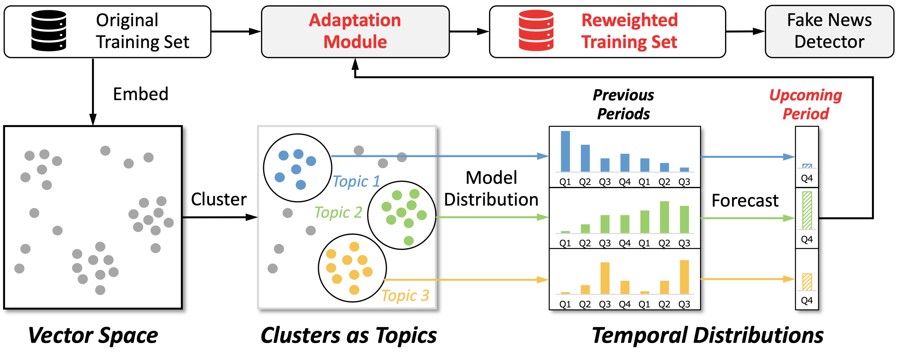

# FTT: Forecasting Temporal Trends for Fake News Detection

Official repository for **[Learn over Past, Evolve for Future: Forecasting Temporal Trends for Fake News Detection](https://aclanthology.org/2023.acl-industry.13.pdf)**, which has been accepted by ACL 2023.



## Introduction

The proposed FTT is a model-agnostic framework, which could tackle the temporal generalization issue by adjusting the training data distribution to be closer to future data distribution.

## Dataset

Due to commercial restrictions, we cannot release the complete dataset. We have placed 500 samples at `roll_seasonal_data/roll_online_bf20_demo`  so you can complete the whole training process. You can create your own dataset following the sample format.

## Code

### File Tree

```bash
.
├── grid_search.py
├── logs  # results save here
│   └── seaonal_res_analyse.ipynb
├── main.py
├── models
│   ├── bert.py
│   ├── eann.py
│   └── layers.py
├── requirements.txt
├── reweight_roll_season
│   ├── get_embeddings.py
│   ├── predict_freq.py
│   ├── roll_seasonal_data  # sample data here
│   ├── roll_seasonal_user_data  # adjusted data save here
│   ├── run.sh  # Step 1 running script
│   ├── single_pass_cluster.py
│   ├── utils.py
│   └── weight_score_cal.py
├── run.sh  # Step 2 running script
└── utils
    ├── dataloader.py
    └── utils.py
```

### Requirements

Refer to requirements.txt

You can run `pip install -r requirements.txt` to deploy the environment quickly.

### Pretrained Models

You can download pretrained models ([sentence-roberta-wwm-ext](https://huggingface.co/imxly/sentence_roberta_wwm_ext) and [chinese-bert-wwm-ext](https://huggingface.co/hfl/chinese-bert-wwm-ext)) and change paths (`sentence_transformer_path` and `bert_path`) in the corresponding scripts.

### Run

The experiment consists of two steps. In Step 1, adjusted training data is generated using the FTT method. In Step 2, the detection model is trained based on the adjusted training data.

#### Step 1: Generate Adjusted Training Data Using FTT

FTT consists of four steps, which are News Representation, Topic Discovery, Temporal Distribution Modeling and Forecasting and Forecast-Based Adaptation. You can complete these four steps by adjusting the parameters in the `reweight_roll_season/run.sh` script and executing the script.

Parameter Configuration:

- data_name: data name under `reweight_roll_season/roll_seasonal_data`
- gpu: the index of gpu you will use
- cluster_threshold: the similarity threshold (denoted as $θ_{sim}$ in the paper) to determine when to add a new cluster
- predict_threshold: the count threshold (denoted as $θ_{count}$ in the paper), we do not consider the clusters with news items less than it
- reweight_threshold: the mape threshold (denoted as $θ_{mape}$ in the paper), we remove the topics which have a mean absolute percentage error (MAPE) larger than it
- thres_low & thres_high: the reweight-bound (denoted as $θ_{lower}$ and $θ_{upper}$ in the paper), we set the weight smaller than thres_low and larger than thres_high as thres_low and thres_high, respectively, to avoid the instability during the training process

#### Step 2: Training the Detection Model Based on the Adjusted Training Data

You can  complete the training process by adjusting the parameters in the `run.sh` script and executing the script.

Parameter Configuration:

- max_len: the max length of a sample, default for `170`
- early_stop: default for `5`
- epoch: training epochs, default for `50`
- gpu: the index of gpu you will use, default for `0`
- lr: learning_rate, default for `2e-5`
- model_name: model_name within `bert, eann_bert`
- root_path: the path to the adjusted data
- data_name: the name set for the adjusted data, which will determine the name of the experimental results

## Citation

```
@inproceedings{hu-etal-2023-learn,
    title = "Learn over Past, Evolve for Future: Forecasting Temporal Trends for Fake News Detection",
    author = "Hu, Beizhe  and
              Sheng, Qiang  and
              Cao, Juan  and
              Zhu, Yongchun  and
              Wang, Danding  and
              Wang, Zhengjia  and
              Jin, Zhiwei",
    booktitle = "Proceedings of the 61st Annual Meeting of the Association for Computational Linguistics (Volume 5: Industry Track)",
    month = jul,
    year = "2023",
    address = "Toronto, Canada",
    publisher = "Association for Computational Linguistics",
    url = "https://aclanthology.org/2023.acl-industry.13",
    doi = "10.18653/v1/2023.acl-industry.13",
    pages = "116--125"
}

```
